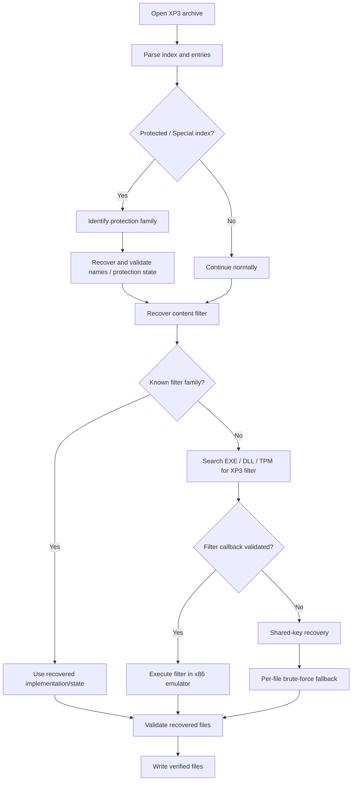
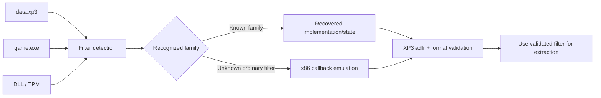
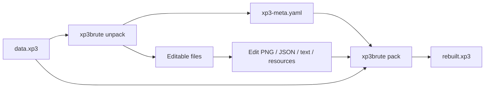

# xp3-brute

`xp3-brute` is a cross-platform tool for extracting, recovering, converting, and rebuilding KiriKiri XP3 archives. It can automatically detect all information needed to unpack protected archives.

```bash
xp3brute unpack data.xp3 out
```

The tool will inspect the archive and write files to `out/`.

`unpack` keeps the normal console view intentionally compact: it emits stable
`status phase=...` progress records plus one final `summary`. The interactive
terminal view renders those same states as a single progress bar. Use
`--verbose` when you need per-probe recovery evidence; use `--no-progress` for
an even quieter embedding-friendly invocation.

Core Ideas:
This time we do not rely on the runtime to extract the archive.
- For complex CXDEC variants, the tool can recover the key parameters.
- For simple KiriKiri encryption filters, the tool can locate and execute the game's real extraction logic in an x86 emulator.
- Use brute-force only as a last fallback when the above methods fail. CPU host and GPU acceleration are supported for brute-force recovery.

---

## Quick start

### Workspace layout

This repository is a Cargo workspace:

```text
xp3-brute/                 # shared core library and xp3brute CLI
apps/xp3-desktop/          # native eframe/egui desktop app
```

The CLI remains the default workspace member, so existing `cargo build` and
`cargo run -- ...` workflows are unchanged. Build the desktop application with:

```bash
cargo build -p xp3-brute --bin xp3brute
cargo run -p xp3-brute-desktop --bin xp3brute-gui
```

The desktop app provides archive browsing, search, raw selected-entry export,
file/folder pickers, and an asynchronous full-unpack view. Full unpack invokes
the same `xp3brute unpack` pipeline and streams its normalized status output
into the operation log. When the CLI is not on `PATH`, set `XP3BRUTE_BIN` to
its absolute path.

### Build

```bash
cargo build --release
```

The executable is:

```text
target/release/xp3brute
```

Tagged releases also publish prebuilt Linux x86_64, macOS arm64, and Windows x86_64 binaries. See [`docs/CI.md`](docs/CI.md) for the CI and release policy, including the Linux glibc compatibility baseline.

A CPU-only build without the optional GPU backend is also available:

```bash
cargo build --release --no-default-features --features magic-sniff
```

### Python / CPython bindings

The project ships a native CPython extension rather than a subprocess wrapper.
It exposes archive inspection and reconstruction, PBD/TLG/AMV conversion,
manifest rebuild/pack/round-trip verification, filter detection, and repeating
XOR recovery. Build/install it with [maturin](https://www.maturin.rs/):

```bash
python -m pip install maturin
maturin develop --release --features python
```

The extension targets Python's stable ABI (Python 3.9+). Structured reports
are returned as JSON strings, ready for `json.loads` or direct logging.

```python
import json
import xp3_brute

archive = xp3_brute.Archive("data.xp3")
print(json.loads(archive.summary_json()))
for entry in archive.entries():
    print(entry.index, entry.name, entry.original_size)

storage_bytes = archive.reconstruct_entry(0)
report = json.loads(xp3_brute.detect_filter_json("game.exe"))
print(report["backend"], report["confidence"])
```

Rust consumers continue to use the same frontend-neutral public API directly;
enabling the `python` Cargo feature only adds the extension module.

---

## Unpack an XP3 archive

```bash
xp3brute unpack data.xp3 out
```

If the game executable is not beside the XP3 archive, specify it explicitly:

```bash
xp3brute unpack data.xp3 out --exe game.exe
```

`--exe` may point to the game executable. The tool can also inspect nearby DLL/TPM modules when looking for an extraction filter.

### What happens automatically



Brute-force recovery is the **last fallback**. The tool first tries to identify and execute the game's real extraction/filter logic.

---

## Convert game resources while unpacking

By default, recovered files are kept in their original format.

Use `--unpacker-all` to enable the available resource converters:

```bash
xp3brute unpack data.xp3 out --unpacker-all
```

| Resource | Default | With `--unpacker-all` |
|---|---|---|
| Compiled TJS2 (`.tjs`) | keep bytecode | high-level decompile, same `.tjs` path |
| TLG5/TLG6 | keep TLG | convert to PNG |
| PSB / SCN / MTN / PIMG | keep original | JSON + decoded PNG/resources |
| PBD | keep original | typed JSON |
| Supported AMV/AJPM | keep original | PNG frames |
| KiriKiri wrapped text | decoded when verified | decoded when verified |

Individual decoders can be selected explicitly:

```bash
xp3brute unpack data.xp3 out --tjs decompile
xp3brute unpack data.xp3 out --tjs emit
xp3brute unpack data.xp3 out --tlg png
xp3brute unpack data.xp3 out --psb json
xp3brute unpack data.xp3 out --psb png
xp3brute unpack data.xp3 out --pbd json
xp3brute unpack data.xp3 out --amv png
```

Explicit options override the `--unpacker-all` preset. TJS2 conversion never changes the filename: `scenario.tjs` remains `scenario.tjs`. If loading/emission/decompilation fails, the original TJS2 bytes are preserved. Repacking treats an extracted text `.tjs` as source text and writes it back directly; `xp3brute` does not attempt to compile it back into TJS2 bytecode.

---

## Inspect an archive

```bash
xp3brute inspect data.xp3
```

Use this when you only want to inspect the XP3 structure, entries, or detected protection family without extracting everything.

---

## Automatic extraction-filter recovery

Older KiriKiri games often protect file contents with an XP3 extraction filter stored in the game EXE, a DLL, or a `.tpm` plugin.

`xp3-brute` can automatically search these modules and validate candidate filters against real XP3 entries.



A generic x86 filter is accepted only after it restores real archive samples and passes the available XP3 `adlr` and file-format checks.

You normally do not need to use the filter diagnostic commands manually.

For troubleshooting:

```bash
xp3brute filter-probe game.exe
xp3brute filter-probe plugin/filter.tpm --dynamic-v2link
```

---

## Protected archives

Protected XP3 variants are detected automatically.

The tool currently includes dedicated handling for:

- historical indirect Special-index variants;
- several CXDEC generations;
- HXV4 authenticated Special indices and their content-filter state;
- ordinary KiriKiri extraction filters that can be located and executed from PE32/i386 modules.

Protection names or four-byte chunk tags are not treated as authoritative identifiers. The tool uses archive structure, executable behavior/state, and validation against real XP3 data.

For normal use, the command remains:

```bash
xp3brute unpack data.xp3 out
```

or:

```bash
xp3brute unpack data.xp3 out --exe game.exe
```

---

## Rebuild an XP3 archive

During unpacking, `xp3-brute` writes:

```text
xp3-meta.yaml
```

This manifest stores the metadata needed to reconstruct the original archive and reapply its filter/protection state.

After editing extracted resources:

```bash
xp3brute pack out rebuilt.xp3
```

If the original archive is no longer at the path recorded during unpacking:

```bash
xp3brute pack out rebuilt.xp3 --source-archive /path/to/data.xp3
```

The default writer is source-template based. It tries to preserve the original XP3 representation rather than rebuilding the archive into a normalized layout.

The original XP3 `adlr` bytes are preserved and are never recomputed.

### Rebuild workflow



---

## Verify a round trip

```bash
xp3brute verify-roundtrip out \
  --source-archive data.xp3 \
  --output rebuilt.xp3
```

For a machine-readable report:

```bash
xp3brute verify-roundtrip out \
  --source-archive data.xp3 \
  --output rebuilt.xp3 \
  --json
```

Verification checks the XP3 container separately from decoded resource formats.

---

## Standalone resource conversion

### TLG

```bash
xp3brute decode-tlg image.tlg image.png
xp3brute decode-tlg image.tlg image.jpg --jpeg-quality 92
xp3brute decode-tlg image.tlg image.bmp
```

Encode an image as TLG:

```bash
xp3brute encode-tlg image.png image.tlg
```

### PBD

```bash
xp3brute decode-pbd script.pbd script.pbd.json
xp3brute encode-pbd script.pbd.json rebuilt.pbd
```

### AMV/AJPM

```bash
xp3brute encode-amv frames/ movie.amv --fps 30 --quality 75
```

---

## GPU acceleration

The default build includes an optional `wgpu` compute backend.

Check available compute devices with:

```bash
xp3brute devices
```

`unpack` defaults to:

```text
--compute auto
```

Other modes are:

```bash
xp3brute unpack data.xp3 out --compute cpu
xp3brute unpack data.xp3 out --compute gpu
xp3brute unpack data.xp3 out --compute hybrid
```

GPU acceleration is used for suitable recovery workloads. Archive parsing, native-filter execution, decompression, and final validation remain CPU-side.

---

## Useful diagnostic commands

These commands are mainly intended for unsupported games or development/debugging:

```bash
# Probe archive recovery hypotheses
xp3brute probe data.xp3 --max-period 1024 --top 8

# Test whether several files share a repeating key
xp3brute shared-probe data.xp3 --max-period 1024 --top 20

# Reconstruct XP3 storage streams without applying a title-specific filter
xp3brute extract-raw data.xp3 out/

# Inspect historical Special-index data
xp3brute scan-special data.xp3

# Analyze an executable for HXV4 information
xp3brute exe-analyze game.exe --archive data.xp3
```

Most users should not need these commands.

---

## Supported areas

`xp3-brute` currently covers the following major areas:

- XP3 raw/zlib index parsing and reconstruction;
- standard / Krkr2 / KrkrZ-style archives;
- historical indirect Special-index variants;
- CXDEC-family content filters;
- generic PE32/i386 XP3 extraction-filter discovery and emulation;
- HXV4 Special and content-filter recovery;
- repeating-key recovery as a final fallback;
- TLG5/TLG6 decoding and TLG5 encoding;
- PSB / SCN / MTN / PIMG parsing and resource extraction;
- PBD decode/encode;
- supported AMV/AJPM resource extraction/rebuilding;
- KiriKiri text wrappers and common game-resource formats;
- source-template XP3 repacking and round-trip verification.

Not every vendor-specific protection can be recovered automatically. Unknown filters or archive variants may still require additional analysis.

---

## Memory usage

`Archive::open` is file-backed; opening a large XP3 does not load the complete archive into RAM.

The unpacker processes final entries in bounded batches. For low-memory environments:

```bash
KRKR_UNPACK_BATCH_SIZE=1 xp3brute unpack data.xp3 out
```

The batch byte budget can also be changed with:

```text
KRKR_UNPACK_BATCH_BYTES
```

---

## Project layout

The crate provides both:

- `xp3_brute`: reusable Rust library;
- `xp3brute`: command-line frontend.

Detailed implementation notes belong under `docs/`. This README intentionally focuses on normal installation, extraction, conversion, rebuilding, and troubleshooting workflows.
