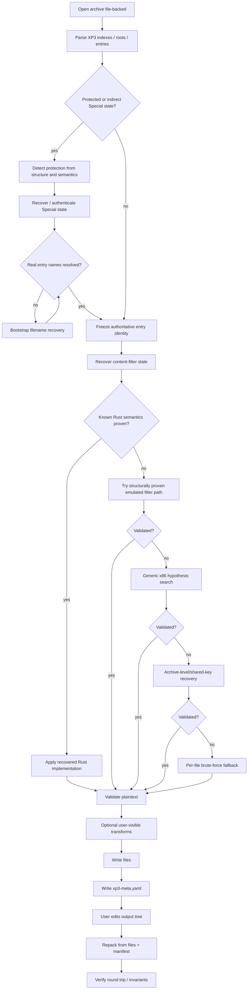

# ADR-0001: Overall Architecture and Processing Pipeline

- Status: Accepted
- Date: 2026-08-24

## Context

`xp3-brute` is no longer only an XP3 parser. A successful extraction may depend on archive-family detection, protected Special-index recovery, filename recovery, executable/module analysis, content-filter recovery, bounded fallback recovery, format conversion, metadata emission, and later reconstruction.

Several of these phases are order-sensitive. In particular, a protected archive can expose only hashes or synthetic names before its real filename layer is recovered. Content heuristics applied before that point can select the wrong crib, filter, or output path. Similarly, generic x86 probing and brute-force recovery must not preempt a known semantic recovery path.

The architecture therefore needs one canonical processing order that all frontends and future refactors preserve.

## Decision

The library and CLI use a staged pipeline. Archive structure is parsed first. Protection/name state is resolved before ordinary content recovery. Known semantic recovery is preferred over guest-code execution, and brute force remains the final fallback. User-visible resource transformations occur only after plaintext has been validated. Repack metadata is emitted from the verified source state and the actual output transformation state.

## Invariants

1. **Name recovery MUST precede ordinary content recovery when the archive has a protected/hash-only name layer.** Authenticated or parsed Special data is not sufficient if entry identities are still hashes or synthetic placeholders.
2. A recovered name is not authoritative merely because it is plausible. It MUST be tied back to archive/Special evidence appropriate to the family.
3. Known semantic recovery implemented in Rust MUST be attempted before generic executable hypotheses for the same family.
4. Emulated x86 code MUST NOT become the default production implementation of a known algorithm when its required parameters/semantics can be recovered and evaluated in Rust.
5. Brute-force recovery MUST remain the final fallback. It MUST NOT be used to hide a detector, parameter-recovery, or filename-recovery failure that can be resolved structurally.
6. Output transformations MUST occur only after the source plaintext has been accepted by the validation layer.
7. Repacking MUST consume `xp3-meta.yaml` as architectural state, not attempt to rediscover immutable archive identity from edited filenames or transformed resources.
8. `Archive::open` and normal extraction SHOULD remain file-backed/bounded; the pipeline MUST NOT require loading an entire large XP3 into memory solely for convenience.

## Phase ownership

| Phase | Primary responsibility |
|---|---|
| XP3 parsing | `src/xp3.rs`, `src/chunk_probe.rs`, `src/format.rs` |
| Protection/Special recovery | `src/special_index.rs`, `src/special_content.rs`, `src/special_params.rs`, `src/hxv4.rs` |
| Script/name bootstrap | `src/script_names.rs`, `src/tjs_symexec.rs`, orchestration in `src/main.rs` |
| Content-filter detection | `src/filter_detection.rs`, `src/legacy_cxdec.rs`, `src/x86_filter.rs` |
| Key/brute recovery | `src/repeating_xor.rs`, `src/solver.rs`, `src/brute.rs` |
| Plaintext validation | `src/validate.rs`, format/magic probes |
| Resource transforms | `src/decoder/*`, `src/encoder/*`, `src/text.rs` |
| Manifest / round trip | `src/xp3_meta.rs`, `src/roundtrip.rs`, `src/encoder/rebuild.rs`, `src/encoder/xp3.rs` |

`src/main.rs` orchestrates the CLI but SHOULD NOT become the sole owner of family semantics. Reusable detection/recovery logic belongs in library modules.

## Alternatives Considered

### Let each detector run independently and accept the first success

Rejected because a weak heuristic can preempt stronger family-specific evidence, and hash-only names can contaminate later content recovery.

### Run generic x86 probing early because it is general

Rejected because it is expensive, harder to audit, and can mask the fact that a known algorithm was not recognized. Generic execution is a fallback, not an architectural shortcut.

### Treat unpack and pack as unrelated tools

Rejected because protected archives require immutable identity and filter state that cannot always be reconstructed from the visible output tree.

## Consequences

The pipeline is more explicit and sometimes waits for name/bootstrap recovery before extracting ordinary files. In exchange, later stages receive stronger identities and parameters, false-positive recovery is reduced, and each fallback has a clear reason for running.

New protection support should fit into an existing phase. A new family should not create an ad-hoc parallel unpack pipeline unless a new ADR establishes why the canonical ordering is insufficient.

## Validation

A pipeline change is acceptable only when representative archives demonstrate that:

- protected names are resolved/authenticated before normal content recovery;
- a known semantic filter preempts generic x86 and brute-force fallbacks;
- all accepted plaintext is validated against available archive and format evidence;
- `xp3-meta.yaml` contains the state needed by the repack path;
- no-edit round-trip checks preserve the invariants in ADR-0002.

## Related ADRs

- ADR-0002: XP3 Container Round-trip Invariants
- ADR-0003: Special Index Detection and Name Recovery
- ADR-0005: Content Filter Detection and Recovery Strategy
- ADR-0009: XP3 Metadata Manifest Design
