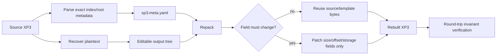

# ADR-0002: XP3 Container Round-trip Invariants

- Status: Accepted
- Date: 2026-08-24

## Context

XP3 archives contain more identity and vendor state than the extracted plaintext files. `File` roots can contain flags, physical names and raw name lengths, segment topology, `adlr`, timestamps, alternate hashes/IDs, unknown/private chunks, and vendor tails. Protected variants add Special data whose original bytes and record linkage may be necessary for reconstruction.

A normalized “make a new XP3 from filenames and content” writer would silently destroy information that is significant to the original game. The most important example is `adlr`: it can be used as the file hash/seed presented to an extraction filter. Recomputing it from edited plaintext can therefore change decryption semantics in addition to changing metadata.

## Decision

Repacking is **source-template based**. The original container representation recorded by the manifest is authoritative for immutable identity and opaque metadata. The packer patches only fields that must change because stored/plaintext sizes or physical offsets changed, and preserves all other source metadata where structurally possible.

The original XP3 `adlr` bytes are immutable.

## Invariants

1. **Original `adlr` bytes MUST be preserved exactly.**
2. The packer **MUST NOT recompute, replace, override, or synthesize `adlr`**.
3. If the source entry has no `adlr`, the packer MUST NOT add one.
4. Recovered or edited filenames MUST NOT be used to regenerate an authenticated/protected identity hash when the original hash is available in the manifest.
5. Physical filename bytes/UTF-16 length and alternate identity fields SHOULD be preserved from the source representation unless the family-specific format explicitly requires a change.
6. Unknown/private child chunks, vendor tails, timestamps, flags, and root/chunk ordering SHOULD remain byte-identical whenever their enclosing layout remains compatible.
7. Original Special/HXV4 stored blobs and authenticated record hashes MUST be preserved unless a family-specific encoder intentionally and validly rebuilds them.
8. Segment offsets and sizes MAY change when content changes. A source physical layout MAY be reused only when the new encoded representation fits its constraints.
9. A no-edit round trip SHOULD reuse exact encoded index objects when no patched field or physical anchor changed.
10. An output transformation being user-editable does not imply that the original binary representation is reconstructible. Exact-round-trip claims MUST distinguish reversible and lossy/non-reversible transforms.

## Mutable versus immutable state

| State | Policy |
|---|---|
| `adlr` child bytes | Immutable; preserve exactly |
| authenticated path/name hashes | Preserve manifest value |
| unknown/private chunks | Preserve exactly where possible |
| timestamps / flags | Preserve exactly where possible |
| original filename representation | Preserve identity/length where possible |
| segment archive offsets | Mutable when placement changes |
| segment stored/original sizes | Mutable when content changes |
| compressed payload bytes | Mutable when plaintext changes |
| derived PNG/JSON/text outputs | Governed by transform-specific ADRs |

## Alternatives Considered

### Recalculate `adlr` after editing

Rejected. In this project `adlr` is not merely a disposable checksum; protection code can consume it as a seed/hash. Recalculation changes archive identity and can make the correct content filter produce the wrong bytes.

### Rebuild a clean canonical XP3 index

Rejected for the default packer. It loses unknown/private metadata and breaks the goal of faithful protected-archive reconstruction.

### Require the original archive forever

Rejected as the only mechanism. `xp3-meta.yaml` deliberately retains exact small metadata objects and protection state so reconstruction does not depend exclusively on rediscovering the original installation. Some transformations or opaque stored payloads may still require retained source material as documented by their metadata.

## Consequences

The writer is more complex than a normalized XP3 encoder and must carry source metadata through the whole workflow. The benefit is that repacking preserves the identity the game's protection logic expects and can make strong no-edit round-trip claims.

## Validation

`verify-roundtrip` SHOULD separately report at least:

- entry identity / physical name preservation;
- original `adlr` / filter seed preservation;
- immutable `File` metadata hash equality;
- Special/HXV4 mapping and stored-byte equality where applicable;
- transformed-resource equivalence according to the relevant codec policy.

A rebuilt archive that contains correct plaintext but changes immutable identity metadata is not considered a faithful round trip.

## Implementation

Primary implementation locations:

- `src/xp3_meta.rs`
- `src/roundtrip.rs`
- `src/encoder/rebuild.rs`
- `src/encoder/xp3.rs`
- `src/xp3.rs`

`RepackPolicies::content_checksums` documents the `adlr` rule in the manifest and must remain consistent with this ADR.
