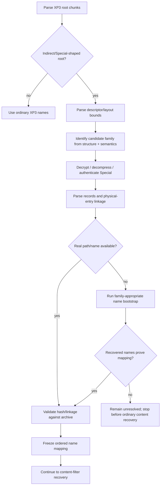

# ADR-0003: Special Index Detection and Name Recovery

- Status: Accepted
- Date: 2026-08-24

## Context

Several protected XP3 variants place filename/path identity in an indirect or vendor-specific Special root instead of exposing a normal trustworthy filename list. Historical implementations often used recognizable four-byte tags, but those tags are mutable vendor metadata and may change between companies or customized builds.

Some families can also reach an intermediate state where Special is decrypted/authenticated and its records are parsed, but only filename/path hashes are known. Treating this state as “names recovered” causes later reconstruction and content recovery to operate on fake or hash-only identities.

## Decision

Special handling is structure-first and validation-driven. Tags and familiar section names MAY contribute low-confidence historical hints but MUST NOT determine the family or decryption algorithm.

A protected archive may proceed to ordinary content recovery only after the required filename/path identity layer for that family has been resolved or authenticated sufficiently to map physical entries to real output identities.

## Invariants

1. Four-byte tags such as `hnfn`, `sen:`, `cbg:`, `dls:`, `yuz:`, or similar vendor labels **MUST NOT be authoritative family identifiers**.
2. `hnfn` MUST NOT be hard-coded as a required detection, parsing, or dispatch key. It MAY appear in diagnostics as an observed sample hint.
3. Detection MUST rely on structural evidence such as chunk shape, length/boundary consistency, descriptor layout, record layout, decompression/decryption semantics, file/hash relationships, and downstream validation.
4. A decrypted/authenticated Special blob with only hashes is **not** equivalent to completed filename recovery.
5. When the family requires real names, hash-only/synthetic names MUST NOT be passed into reconstruct, normal content recovery, output-path selection, or name-dependent crib selection.
6. The ordered relationship between a Special record and its physical XP3 entry MUST be preserved in `xp3-meta.yaml`; it MUST NOT be regenerated later from the visible recovered filename.
7. Original Special record hashes and authenticated HXV4 hashes are source identity and MUST be preserved for repacking.
8. If multiple candidate decoders or name mappings survive structural parsing, real archive validation MUST select among them; the first syntactically parseable candidate is insufficient.

## Evidence model

Strong evidence includes:

- descriptor/root bounds are internally consistent;
- decrypted payload has a coherent record layout;
- compression wrapper decodes to the declared size;
- record count/linkage agrees with actual XP3 entries;
- recovered names reproduce the stored hash relation or authenticated mapping;
- subsequent content validation succeeds using the mapped entry identities.

Weak/non-authoritative evidence includes:

- a historical tag string;
- a module/game filename;
- a title-specific constant with no semantic derivation;
- a plausible decoded filename list with no linkage proof.

## Alternatives Considered

### Dispatch directly on known Special tags

Rejected. Vendors can rename tags without changing the underlying layout or cipher, and different products can reuse familiar labels for different behavior.

### Continue using hash strings as filenames

Rejected for normal recovery. This loses the semantic identity needed by scripts, path hashes, name-dependent filters, and faithful repacking.

### Infer record mapping later from sorted filenames

Rejected. Special record order/linkage is source metadata and must be preserved when it is available.

## Consequences

Protection detection requires more structural analysis than a tag table, but it generalizes to customized variants and reduces title-specific branches. Some archives intentionally stop in an unresolved state instead of producing misleading output; this is preferable to advancing with invalid identities.

## Validation

A Special/name recovery is proven only when the family-appropriate checks pass. At minimum, the implementation should report the root/record layout and the number of mapped versus unresolved physical entries. For authenticated families, authentication must succeed before records become authoritative.

## Implementation

Primary implementation locations:

- `src/special_index.rs`
- `src/special_content.rs`
- `src/special_params.rs`
- `src/cxdec_names.rs`
- `src/hxv4.rs`
- `src/script_names.rs`
- orchestration and fixed-point bootstrap logic in `src/main.rs`
- manifest linkage in `src/xp3_meta.rs`

The structural/non-authoritative tag policy is also reflected in `src/filter_detection.rs`.
