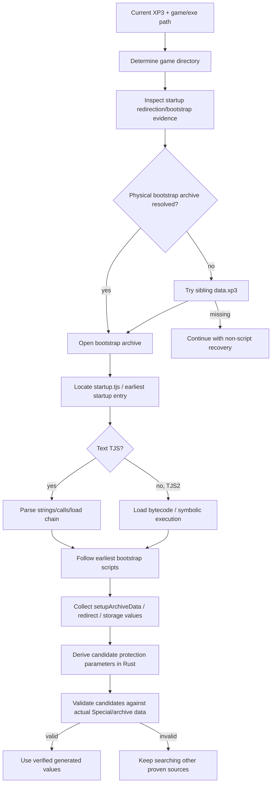

# ADR-0004: Startup and Bootstrap Parameter Recovery

- Status: Accepted
- Date: 2026-08-24

## Context

Protection parameters are not always statically embedded in the XP3 currently being unpacked or in the main executable. KiriKiri games commonly establish archive behavior from startup scripts. A sibling archive—especially `data.xp3`—may expose `startup.tjs`, redirect the virtual startup path, load additional bootstrap scripts, and call APIs such as `Storages.setupArchiveData` with values that generate Special/CXDEC state.

If recovery inspects only the user-selected XP3, it can miss the earliest initialization source and fall back unnecessarily to generic executable probing or brute force.

Startup scripts may be source text or compiled TJS2 bytecode. Parameter recovery therefore cannot assume that readable source text is available.

## Decision

Bootstrap recovery is game-scoped rather than archive-scoped. Once a game directory or executable path is known, the tool automatically searches for the sibling bootstrap archive and follows the earliest relevant startup-script chain before declaring Special/CXDEC parameters unavailable.

The normal preferred bootstrap archive is the game-directory `data.xp3`, but the implementation MAY follow a structurally recovered startup redirection when it identifies another physical archive.

## Invariants

1. Bootstrap parameter recovery MUST NOT be limited to the XP3 passed on the command line when the game directory/executable is known.
2. The tool SHOULD automatically inspect the same game directory for `data.xp3` or a structurally resolved startup redirect before falling back to weaker recovery.
3. `startup.tjs` is a bootstrap anchor when supported by archive evidence; it MUST NOT be assumed to be entry zero in every arbitrary sibling archive.
4. Compiled TJS2 MUST be analyzed using bytecode/string-pool/control-flow semantics where needed. The absence of readable source text is not a reason to skip bootstrap recovery.
5. Script execution for recovery SHOULD be symbolic/structural. The tool MUST NOT require launching the game or executing arbitrary script code natively.
6. Values observed in `Storages.setupArchiveData` or equivalent bootstrap paths are candidates until the derived Special/CXDEC state validates against real archive data.
7. A redirect, string literal, or API name alone is insufficient proof; the relevant call/dataflow relation must be established.
8. Script-chain traversal MUST be bounded and cycle-aware.

## Why `data.xp3` is automatic

The user can request extraction of `patch.xp3`, `scenario.xp3`, or another sibling while the protection setup is still defined in `data.xp3`. Requiring a manual second pass would make the recovery result depend on which archive happened to be selected first. The architecture therefore treats the game directory as the bootstrap scope.

## Alternatives Considered

### Search only the current archive

Rejected because initialization state can live in a different sibling archive.

### Search only the executable for constants

Rejected because scripts may generate control blocks/keys dynamically from text values while the executable contains only the generator.

### Decompile every TJS2 file to source first

Rejected as a prerequisite. Parameter recovery needs a reliable, bounded semantic path and can often extract the necessary values directly from bytecode/symbolic execution. User-facing decompilation is a separate output policy (ADR-0011).

## Consequences

Recovery may open one or more sibling archives even when the user asked to unpack only one. This is intentional game-level analysis, not implicit extraction of those archives. Diagnostics should clearly distinguish the target archive from bootstrap sources.

## Validation

For a script-derived parameter set, diagnostics SHOULD record:

- physical bootstrap archive and startup route;
- number of startup/bootstrap scripts traversed;
- relevant API calls and resolved values;
- unresolved calls/states where useful;
- the downstream archive/Special validation that promoted the values from candidate to proven.

## Implementation

Primary implementation locations:

- `src/script_names.rs`
- `src/tjs_symexec.rs`
- `src/special_params.rs`
- `src/legacy_cxdec.rs`
- game/bootstrap orchestration in `src/main.rs`
- XP3 access in `src/xp3.rs`
