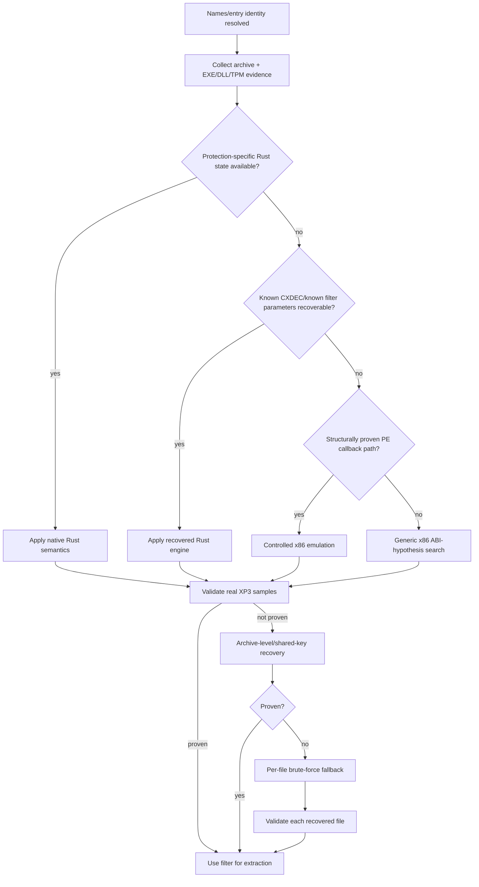

# ADR-0005: Content Filter Detection and Recovery Strategy

- Status: Accepted
- Date: 2026-08-24

## Context

XP3 content protection can be implemented as a known algorithm, a parameterized CXDEC generator, a KiriKiri extraction callback in an EXE/DLL/TPM, an archive-level repeating transformation, or a title-specific unknown mechanism. A “universal” generic x86 search is attractive but expensive and can obscure a failure to recognize an algorithm that should have been recovered semantically.

The tool also has multiple validation signals: original `adlr`/filter seed, expected archive structure, format magic, decompressor success, cross-entry consistency, and protection-family-specific checks. Candidate discovery and candidate acceptance must remain separate.

## Decision

Content recovery follows a strict strongest-evidence-first fallback order. A later, more general method runs only if earlier semantic recovery failed to produce a proven result.

The exact internal split between “structurally proven callback” and “generic ABI hypothesis” may evolve, but both remain below known semantic recovery and above brute force.

## Invariants

1. Detection and execution are separate. A module/callback is a **candidate** until real archive samples prove its semantics.
2. A known family with recoverable parameters MUST be evaluated in owned Rust code rather than selecting generic x86 merely because a callback exists.
3. Static PE evidence, registration provenance, and family semantics SHOULD narrow the search before ABI hypotheses are generated.
4. Generic x86 hypothesis search MUST NOT run merely because a known-family recognizer returned an internal recoverable error; the detector should surface/fix the semantic recovery gap first when possible.
5. A filter candidate MUST be tested on real XP3 entries. Synthetic-only self-tests are insufficient for production acceptance.
6. Validation SHOULD use multiple entries when practical. A one-entry success may be used only as an intermediate survivor stage.
7. Original `adlr` values MAY be used as source validation/filter seeds but MUST NOT be recomputed (ADR-0002).
8. Brute-force recovery MUST be last. Per-file recovered keys are recorded only when that entry actually required brute-force recovery.
9. Game title, executable filename, plugin filename, mutable Special tag, or fixed sample RVA MUST NOT select a content filter.
10. Failure of one executable hypothesis MUST NOT prevent trying other structurally relevant sibling modules.

## Candidate states

Use terminology consistently:

- **discovered** — a module/function/parameter shape was found;
- **candidate** — enough evidence exists to attempt it on archive samples;
- **survivor** — it passed a cheap/sample-stage check;
- **proven/verified** — it passed the required real-archive validation and may drive extraction.

Diagnostics should not label a merely discovered callback as “selected” or “working”.

## Alternatives Considered

### Always execute the game's original callback

Rejected. It increases emulation complexity and trust surface, and it prevents the project from owning a portable implementation of known semantics.

### Brute force first because it eventually recovers bytes

Rejected. It is expensive, produces per-file state instead of a reusable algorithm, and hides recognition bugs.

### Accept a filter after one plausible magic header

Rejected. Many wrong hypotheses can produce short accidental matches. Multi-entry/adlr/format evidence is stronger.

## Consequences

The detector contains more explicit routing logic, but logs become diagnostically meaningful: a user can see whether failure occurred in family recognition, parameter recovery, callback emulation, generic ABI search, or final fallback.

## Validation

A production content filter is accepted only when it restores real archive samples and passes all applicable integrity/format checks. The validation set SHOULD include entries with different sizes/offsets and, for parameterized algorithms, values that exercise different branches of the transform.

## Implementation

Primary implementation locations:

- `src/filter_detection.rs`
- `src/legacy_cxdec.rs`
- `src/cxdec_classic.rs`
- `src/x86_filter.rs`
- `src/win32_host.rs`
- `src/repeating_xor.rs`
- `src/solver.rs`
- `src/brute.rs`
- `src/validate.rs`
- orchestration/progress diagnostics in `src/main.rs`
