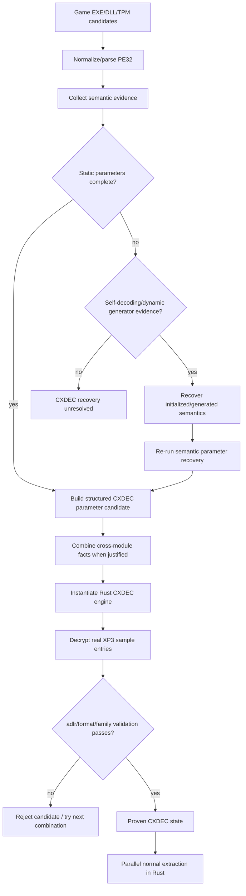

# ADR-0006: CXDEC Architecture and Parameter Recovery

- Status: Accepted
- Date: 2026-08-24

## Context

“CXDEC” is not one fixed byte-wise cipher. Historical implementations contain multiple generator generations and wrappers, often distributed across EXE/DLL/TPM modules. Some modules store a 4096-byte control table, construct 128 generated x86 lanes, use classic or variant PRNG state, split the file at a hash-derived boundary, or decode/generate their executable region at runtime.

The project needs to distinguish three concerns:

1. identifying a semantic CXDEC generation;
2. recovering the parameters/state needed by that generation;
3. applying the resulting content transform to XP3 entries.

Combining these concerns into “execute this plugin callback” makes the implementation opaque, platform-dependent, and difficult to validate.

## Decision

CXDEC is represented as semantic generations and structured parameters. Original x86 is evidence/recovery input; the production content transform is implemented in Rust once the required parameters have been recovered.

Generation names describe algorithm deltas, not game titles, module filenames, or Special tags.

## Semantic generations

The code may recognize generations including, but not limited to:

- `Classic` / standard classic-generator behavior;
- `CxEncryption` — classic parameterized generator semantics such as hash boundary plus 3/8/6 dispatch/control-table state;
- `EarlyDynamicXcode` — object/manager-based 128-lane dynamic generation distinguished by generator semantics;
- `Cabbage` — variant PRNG/seed behavior;
- `Riddle` — additional wrapper/prefix behavior;
- `Senren`, `Nana`, and future recovered variants where a real algorithm delta is established.

A generation MUST NOT exist merely because one game needs a special case. If the semantic delta cannot yet be characterized, retain a diagnostic `Recovered(...)`/unclassified state rather than naming it after a title.

## Structured parameters

Depending on generation, recovered state can include:

- boundary `mask` and `offset`;
- a 4096-byte control block (`1024 × u32`);
- `prolog[3]`, `even[8]`, and `odd[6]` generator dispatch orders;
- classic LCG semantics (`0x41c64e6d`, `0x3039`) where they are an algorithm invariant;
- Cabbage/random seed state;
- wrapper/prefix transforms;
- generator/builder provenance used only to prove where the parameters came from.

Algorithm-intrinsic constants are permitted evidence. Title-specific constants are not production detection rules (ADR-0020).

## Invariants

1. CXDEC identification MUST be semantic. Game titles, archive tags, plugin filenames, and sample-specific RVAs MUST NOT select a generation.
2. Filename/Special handling is independent from content decryption. A familiar Special tag does not imply a CXDEC generation.
3. Parameters MAY be combined across executable modules only when each fact has independent structural/semantic provenance and the final combination validates against the same real archive.
4. The 4096-byte control block alone is not enough to prove a complete CXDEC profile; required generator/boundary/seed state must also be recovered or generated.
5. Static absence of a generator constant is not proof that the family is absent when the module is self-decoding or dynamically generated.
6. Self-decoding recovery MUST ultimately expose semantics that the normal matcher can validate. “Section changed” alone is insufficient proof of CXDEC.
7. Once a complete parameter set is proven, normal extraction MUST use the Rust CXDEC engine rather than repeatedly executing guest x86 per file.
8. Original x86 execution, when necessary, is restricted by ADR-0007 and is a parameter/semantics recovery mechanism, not the architectural decryption backend.
9. Known published/sample parameter sets MAY be tests or validation fixtures but MUST NOT be embedded as title-dispatch tables in automatic production recovery.
10. A parameter candidate becomes authoritative only after real XP3 validation.

## Self-decoding modules

Some CXDEC modules encode executable material on disk and recover it during initialization. Recovery SHOULD prefer the narrowest understandable mechanism:

1. statically recognize and reproduce the module's self-decoder when its semantics can be proven;
2. otherwise use bounded controlled initialization and snapshot the resulting image;
3. rerun the ordinary semantic matcher on the recovered image;
4. reject the result if the expected generator semantics do not emerge.

A future ADR-0008 may further specify self-modifying implementation details without changing the principles above.

## Alternatives Considered

### Maintain a table of game title -> known CXDEC parameters

Rejected. It does not generalize, silently fails for repacks/customized executables, and turns fixtures into production architecture.

### Treat every CXDEC as a generic KiriKiri callback

Rejected. It discards reusable algorithm structure and makes every extracted file depend on x86 emulation.

### Require all parameters to live in one PE

Rejected. Real games can split generators, control state, and bootstrap-generated values across executable/script/module boundaries.

## Consequences

CXDEC support requires more reverse-engineering logic up front, but successful recovery produces portable, deterministic Rust state that can be cached, parallelized, tested, and recorded in diagnostics.

## Validation

A CXDEC parameter set SHOULD be validated on multiple real entries and exercise both sides of any hash-derived split where practical. Validation uses original archive identity (`adlr`/hash), decompression/format evidence, and cross-entry consistency. Known fixtures should additionally assert exact recovered mask/offset/orders/control state without being used by production dispatch.

## Implementation

Primary implementation locations:

- `src/cxdec_classic.rs`
- `src/legacy_cxdec.rs`
- `src/filter_detection.rs`
- `src/cxdec_names.rs` (name/index concern, intentionally separate)
- `src/embedded_pe.rs`
- `src/pe_normalize.rs`
- optional controlled recovery support in `src/x86_filter.rs` / `src/win32_host.rs`
