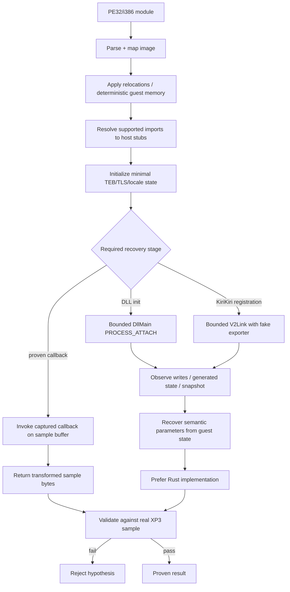

# ADR-0007: Controlled x86 Execution Boundary

- Status: Accepted
- Date: 2026-08-24

## Context

Older KiriKiri protection frequently lives in PE32/i386 EXEs, DLLs, or TPM plugins. Some filters register through `V2Link`, allocate/generated code, use TLS/locale APIs, or rely on small parts of the Win32 environment. Static recovery is not always sufficient.

Executing an untrusted game module natively would be unacceptable for a cross-platform analysis tool. At the same time, emulating an entire Windows/KiriKiri process is unnecessary and creates a large, unstable compatibility surface.

## Decision

When original x86 must be observed, `xp3-brute` uses a **bounded guest execution environment** based on an emulated PE32/i386 image and a deliberately small Win32/KiriKiri host. Guest code is never executed natively on the user's host by the automatic recovery path.

The emulator exists to recover registration provenance, initialization state, callback behavior, or algorithm parameters that can then be validated. It is not a general Windows compatibility layer.

## Invariants

1. Automatic analysis MUST NOT `dlopen`, load, or otherwise execute the game EXE/DLL/TPM natively on the host OS.
2. Guest execution MUST be limited to PE32/i386 code supported by the emulator. Unsupported architectures are not silently executed by another mechanism.
3. The Win32 host MUST be explicit and deterministic. Missing imports SHOULD fail/diagnose the hypothesis rather than calling through to arbitrary host APIs.
4. Filesystem, process, network, registry, and similar side effects MUST NOT escape the emulated environment.
5. `DllMain`, `V2Link`, and callback invocation are distinct recovery stages. The tool SHOULD execute only the minimum stage necessary for the evidence being recovered.
6. Guest instruction count, memory mappings, recursion/state exploration, and other potentially unbounded behavior MUST have limits.
7. Capturing a registration/callback address proves provenance, not correctness. The callback MUST still validate on real XP3 data.
8. For a known semantic family, x86 execution SHOULD end once the required parameters/state can be expressed in owned Rust data.
9. Emulator/Unicorn handles and mutable guest state MUST NOT leak into pure detection results or global hidden state. Parallel extraction should use owned/session state with explicit lifecycle.
10. Emulation errors are diagnostic evidence about a hypothesis; they MUST NOT be treated as proof that the archive has no filter.

## Host surface

The host MAY provide narrowly defined behavior for APIs required by real KiriKiri modules, including memory allocation/protection, TLS, locale/code-page queries, selected string/file-enumeration helpers, and instruction-cache synchronization. A new API stub should be added only when a real initialization/filter path requires it and its deterministic semantics are understood.

A no-op is acceptable only for an API whose externally visible behavior is irrelevant to the guest result (for example, instruction-cache flush inside an interpreter), and this choice should be documented in code.

## Alternatives Considered

### Native execution inside a child process/sandbox

Rejected as the default architecture. It remains OS-specific, has a larger attack/side-effect surface, and cannot provide the same deterministic cross-platform state introspection.

### Full Windows emulation

Rejected. The project needs a recovery harness, not an operating system. Expanding the host surface without evidence increases complexity and hides unsupported assumptions.

### Static analysis only

Rejected as an absolute rule because dynamic/self-modifying modules can withhold required semantics until initialization.

## Consequences

Some PE modules remain unsupported because their required host environment is outside the deliberate boundary. This is acceptable; unsupported behavior should result in a clear fallback rather than an unsafe execution shortcut.

## Validation

A new guest execution path should be tested with:

- deterministic repeated runs;
- bounded failure for malformed/unsupported modules;
- no host side effects outside intended input/output files;
- real archive samples proving the recovered callback/state;
- equivalence with a Rust semantic implementation when one exists.

## Implementation

Primary implementation locations:

- `src/x86_filter.rs`
- `src/win32_host.rs`
- `src/pe_normalize.rs`
- `src/embedded_pe.rs`
- public routing in `src/filter_detection.rs`
