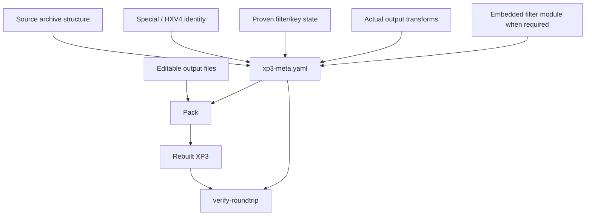

# ADR-0009: XP3 Metadata Manifest Design

- Status: Accepted
- Date: 2026-08-24

## Context

The visible unpacked directory is not a complete representation of a protected XP3 archive. Repacking may require original index/root bytes, immutable `adlr`, alternate hashes/IDs, Special record linkage, HXV4 authenticated values, filter state, brute-force-only keys, embedded PE filter modules, and metadata describing transformations such as TLG/PSB/PBD/AMV/text conversion.

If this state is kept only in logs or inferred again during packing, edited archives become non-deterministic and can lose the exact identity expected by the game.

## Decision

Every normal unpack intended to support reconstruction writes `xp3-meta.yaml` in the output root. The manifest is a **repack manifest**, not a diagnostic dump. Fields are included because the packer/round-trip verifier may need them or because they preserve authoritative source identity that must not be regenerated.

## Manifest responsibilities

The manifest records, as applicable:

- source archive path/name, family, XP3 offset, physical size, entry count;
- decoded and/or exact encoded index templates and root-chunk provenance;
- immutable per-entry filename representation, flags, original `adlr`, alternate hash/ID, segment metadata, and unknown/private metadata needed for reconstruction;
- exact stored Special blobs plus parsed record-to-entry linkage and original Special hashes;
- HXV4 descriptors, authenticated hashes, keys/nonces/state required for repacking;
- archive-level recovery keys/state;
- **per-file keys only for entries that actually required brute-force recovery**;
- exact PE32 filter module bytes/state when edited entries require that filter and the original game installation should not be a mandatory dependency;
- the actual resource transformation applied to each output and the information required by its encoder/round-trip verifier;
- explicit repack policies such as immutable `adlr` and identity-hash preservation.

## Invariants

1. The manifest MUST treat original protected identity values as authoritative. The packer MUST NOT replace them by hashing a recovered/edited visible filename when the source value is present.
2. Original `adlr` MUST be recorded/preserved according to ADR-0002 and MUST NOT be presented as a recomputable checksum policy.
3. A per-file key MUST be written only when that entry was recovered by a per-file brute-force path. Deterministic family/global keys SHOULD be represented at the appropriate archive/filter level instead of redundantly per entry.
4. Exact Special/HXV4 record linkage MUST be preserved, not reconstructed from output ordering.
5. Transform metadata MUST describe what was actually written. A failed transform that fell back to original bytes must not be recorded as if conversion succeeded.
6. Non-reversible transforms MUST be marked as such; the verifier MUST NOT claim byte-exact restoration solely from semantic/pixel equivalence.
7. Diagnostic counters, progress timings, rejected hypotheses, and verbose reverse-engineering traces SHOULD NOT become persistent manifest fields unless the packer/verifier needs them.
8. Schema evolution MUST be backward-aware. New optional fields SHOULD use defaults/`Option` where old manifests can still be interpreted safely.
9. The packer MUST fail clearly when required reconstruction state is missing rather than silently regenerating identity using a weaker rule.

## Source of truth hierarchy

When repacking, prefer:

1. immutable/authenticated values stored in the manifest;
2. explicit edited output content for mutable plaintext/resources;
3. family-specific encoder output derived from (1) and (2);
4. source archive bytes/templates when the manifest identifies them as opaque/preserved state.

Visible filenames and content-derived hashes are not allowed to override source identity simply because they are easier to recompute.

## Alternatives Considered

### Store only a small list of keys

Rejected. XP3 reconstruction needs more than encryption state; it also needs container identity and transform provenance.

### Copy the whole original archive into the output directory

Rejected as the sole design. It is wasteful and does not explicitly model which fields are authoritative or how edited resources map back to entries.

### Put all reverse-engineering diagnostics into YAML

Rejected. The manifest should remain stable and packer-oriented rather than becoming an unbounded log format.

## Consequences

The manifest is a compatibility contract. Changes to its semantics require care and often an ADR/schema update. This extra discipline enables deterministic pack/verify behavior and lets future maintainers understand why a value must be preserved instead of recalculated.

## Validation

Manifest tests should cover serialization/deserialization, old optional fields, no-edit round trips, protected Special linkage, brute-force-only key recording, and transformed-resource repacking. `verify-roundtrip` should consume the manifest rather than duplicating recovery heuristics.

## Implementation

Primary implementation locations:

- `src/xp3_meta.rs`
- `src/roundtrip.rs`
- `src/encoder/rebuild.rs`
- `src/encoder/xp3.rs`
- manifest creation/orchestration in `src/main.rs`
