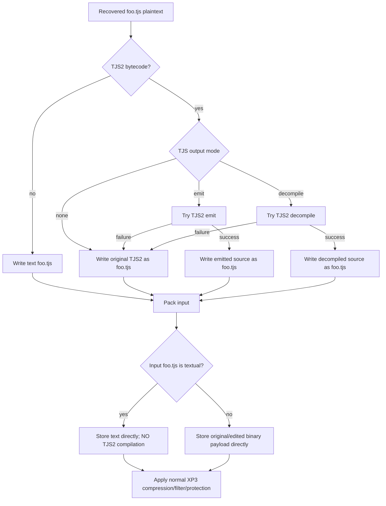

# ADR-0011: TJS/TJS2 Output and Repack Policy

- Status: Accepted
- Date: 2026-08-24

## Context

KiriKiri `.tjs` entries may contain source text or compiled TJS2 bytecode. The project has a TJS2 reader/decompiler component that can produce a higher-level decompile form or a lower-level emit form, but it does **not** provide a TJS source-to-TJS2 compiler.

Users need readable/editable scripts during unpacking. Adding suffixes such as `.decompile.tjs` or `.emit.tjs` makes the extracted tree diverge from the paths referenced by the game and complicates repacking. Pretending that decompilation is reversible would be worse: the packer would later need a compiler that does not exist and could not reproduce original bytecode exactly.

## Decision

TJS handling is an output policy with three modes:

- `none` — preserve the recovered `.tjs` payload in its original text/TJS2 representation;
- `emit` — when the payload is TJS2, write the emitter result to the **same `.tjs` path**;
- `decompile` — when the payload is TJS2, write the high-level decompiler result to the **same `.tjs` path**.

`emit` and `decompile` are best-effort. If loading or conversion fails, the original recovered TJS/TJS2 bytes are written unchanged.

Packing never compiles textual TJS back into TJS2. If the output tree contains textual `.tjs`, those text bytes are the plaintext that the XP3 packer stores (after only the normal XP3 compression/filter/protection layers).

## Invariants

1. TJS output mode MUST NOT change the archive-relative filename. `foo.tjs` remains `foo.tjs`; no `.emit`, `.decompile`, or similar suffix is added.
2. `emit`/`decompile` MUST be atomic best-effort transforms. If conversion fails at any stage, the original recovered payload MUST be written instead of a partial/empty source file.
3. The original TJS2 payload MUST remain available as the fallback until conversion has completed successfully.
4. TJS2 decompilation/emit MUST NOT be modeled as a reversible binary transform requiring the packer to recreate original bytecode.
5. The packer MUST NOT invoke or assume a TJS compiler. The currently integrated component has no compilation capability.
6. A textual `.tjs` present in the edited output tree is packed as textual TJS plaintext. Only the archive's normal compression/encryption/filter layers are applied afterward.
7. A binary TJS2 `.tjs` that was preserved/fell back is packed as those binary bytes; it is not decompiled implicitly during pack.
8. `--unpacker-all` MAY choose a readable TJS default, but an explicit TJS mode MUST override the preset.
9. User-facing TJS conversion and internal TJS2 symbolic analysis for bootstrap recovery are separate concerns. Bootstrap analysis MUST NOT depend on the user selecting a decompile output mode.
10. Manifest transform state MUST record success/fallback accurately and MUST NOT tell the repacker to “reverse decompile” textual TJS.

## Output-path rationale

Archive scripts reference one another by their original storage paths. Keeping the same path makes the unpacked tree editable in place and means a repack naturally picks up the modified script without a rename/mapping layer.

## Alternatives Considered

### Write `foo.decompile.tjs` beside original `foo.tjs`

Rejected as the default. The editable file is no longer the file that repacking naturally consumes, and script-relative paths no longer match the tree users are editing.

### Replace `.tjs` with source but recompile during pack

Rejected because the integrated component does not compile TJS source and because decompilation is not guaranteed to reconstruct bytecode exactly.

### Fail the entire unpack if one TJS decompile fails

Rejected. Script readability is optional output enhancement; a valid original TJS2 payload is more valuable than failing extraction or writing an empty file.

## Consequences

An archive unpacked with `emit`/`decompile` and then repacked may intentionally contain textual TJS where the source archive contained TJS2 bytecode. This is a supported semantic edit, not a byte-exact TJS2 round trip. Users requiring byte preservation should select `none` or leave a failed conversion fallback untouched.

## Validation

Tests should include:

- source-text `.tjs` unchanged under all modes;
- valid TJS2 for both `emit` and `decompile` with identical output path;
- malformed/unsupported TJS2 falling back byte-for-byte to the original payload;
- packing textual `.tjs` without invoking a compiler;
- internal bootstrap/TJS2 symbolic execution functioning independently of output mode.

## Implementation

Primary implementation locations:

- CLI/output orchestration in `src/main.rs`
- TJS2 semantic analysis in `src/tjs_symexec.rs`
- `tjs2dec` dependency in `Cargo.toml`
- manifest representation in `src/xp3_meta.rs`
- text/wrapper handling in `src/text.rs` and `src/encoder/text.rs`
