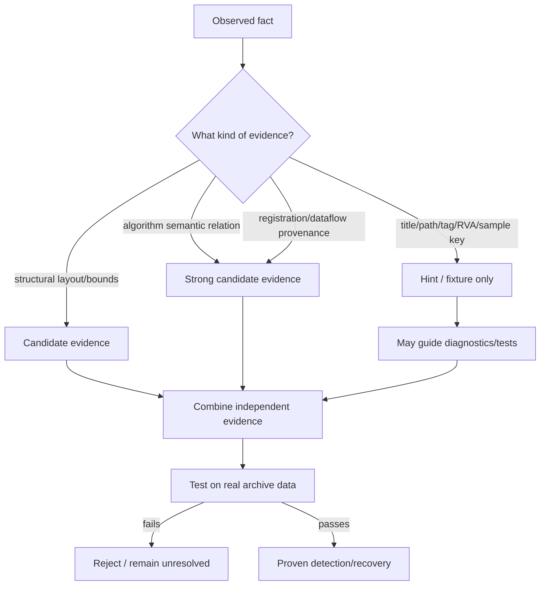

# ADR-0020: Detection Evidence and Anti-hardcoding Rules

- Status: Accepted
- Date: 2026-08-24

## Context

Protection reverse engineering naturally begins with concrete games and modules. This creates a recurring risk: a fact that is useful for understanding one sample—title name, plugin filename, Special tag, RVA, magic constant, known key—can accidentally become a production dispatch rule.

Such rules appear to fix the current sample but fail on customized builds, other vendors using the same algorithm, or the same vendor changing labels. They also make it impossible to tell whether the implementation actually understands the structure/algorithm.

The project therefore needs a common evidence policy across Special, CXDEC, HXV4, and generic filter detection.

## Decision

Production detection is based on **structure, semantics, provenance, and real-data validation**. Sample/title-specific knowledge is allowed as a test fixture, reverse-engineering hint, or diagnostic label only; it cannot be the condition that selects an algorithm or declares success.

## Evidence levels

### Level 0 — fixture/hint only

Examples:

- game title/product string;
- `game.exe`, `cxdec.tpm`, `PackinOne.dll`, or other module filename;
- historical Special tags such as `hnfn`, `sen:`, `cbg:`, `dls:`, `yuz:`;
- a sample-specific RVA/file offset;
- a known per-title key/seed/parameter tuple;
- “this worked for game X”.

Level-0 evidence MUST NOT select a production family by itself.

### Level 1 — structural evidence

Examples:

- valid PE32/i386 image and section bounds;
- Special descriptor shape and length consistency;
- 4096-byte control-table shape;
- record count/size/layout relationships;
- well-formed compression/authentication wrapper;
- executable registration/callback pattern with coherent addresses.

Structural evidence creates candidates but may still be shared by unrelated implementations.

### Level 2 — semantic/provenance evidence

Examples:

- recognized PRNG/dataflow semantics;
- recovered `(hash & mask) + offset` boundary behavior;
- 3/8/6 generator dispatch semantics;
- `V2Link` -> exporter resolution -> `TVPSetXP3ArchiveExtractionFilter` -> callback provenance;
- a self-decoder that transforms an encoded section into code containing the expected independent algorithm semantics;
- script dataflow proving a value reaches `Storages.setupArchiveData`.

### Level 3 — real archive validation

Examples:

- decrypted Special authenticates/decompresses and maps records coherently;
- recovered names reproduce stored hash/linkage relationships;
- filter restores multiple real XP3 entries and satisfies original `adlr`/format evidence;
- a generated parameter set works consistently across independent entries.

Level 3 is what promotes a candidate to **proven** for extraction.

## Invariants

1. Production code MUST NOT branch on a game title to select a protection algorithm.
2. Production code MUST NOT require a specific executable/DLL/TPM filename when equivalent modules can be discovered structurally.
3. Mutable four-byte tags MUST NOT be authoritative family identifiers. In particular, `hnfn` MUST NOT be a required recognition/dispatch key.
4. Sample-specific RVAs/offsets MUST NOT be used as detection constants. RVAs discovered by semantic scanning/provenance within each PE are permitted.
5. Known per-title keys, masks, offsets, branch orders, or seeds MUST NOT be automatic recovery results. They MAY be fixture expectations used to test the generic recovery implementation.
6. Algorithm-intrinsic constants are allowed when they are part of the semantics being recognized (for example a defined PRNG multiplier), but they SHOULD be combined with independent structural/semantic evidence.
7. Human-readable strings/API names MAY be evidence of provenance when tied to executable dataflow; string presence alone is insufficient.
8. A candidate that satisfies Level 1/2 evidence but fails real archive validation MUST be rejected, not retained because it matches a known title.
9. A known title MAY appear in diagnostics or test names only after/beside the semantic result; the semantic result must remain valid if the title string is removed.
10. New detectors SHOULD explain in comments/tests which evidence establishes structure, which establishes semantics, and which real-data check proves the result.

## Acceptable use of fixtures

Fixtures are encouraged for regression testing. For example, a test may assert that a generic CXDEC recovery algorithm extracts a particular mask/offset/order tuple from a known module. The prohibited design is the inverse: looking up that tuple because the module/game is known.

Likewise, a historical tag may be logged as a useful hint while the actual parser chooses the route from descriptor size, decoded structure, and validation.

## Alternatives Considered

### Maintain a compatibility database keyed by game title

Rejected as the primary architecture. It can exist externally for tests/research, but the extractor should recover semantics from the files it is given.

### Ban all constants and strings from detectors

Rejected. Algorithm definitions and API provenance legitimately contain constants/strings. The distinction is whether the evidence is semantic and generalizable or merely identifies a known sample.

### Accept high-confidence heuristics without real archive validation

Rejected where real samples are available. The archive itself is the final oracle for whether recovered parameters actually represent the protection in use.

## Consequences

Initial implementation may take longer because each sample fix must identify the generalizable mechanism. In return, support extends to renamed/customized variants and future contributors can distinguish architecture from a collection of per-game patches.

## Validation

Every new protection detector should include tests or diagnostic evidence demonstrating:

- title/module/tag independence;
- structural bounds safety;
- semantic relation/provenance where applicable;
- rejection of a near-miss or invalid candidate;
- acceptance only after real archive validation when extraction data is available.

## Implementation

This policy applies across the project, especially:

- `src/filter_detection.rs`
- `src/legacy_cxdec.rs`
- `src/cxdec_classic.rs`
- `src/cxdec_names.rs`
- `src/special_index.rs`
- `src/special_content.rs`
- `src/special_params.rs`
- `src/hxv4.rs`
- `src/x86_filter.rs`
- `src/main.rs`
