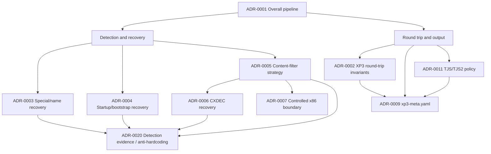

# Architecture Decision Records

This directory records architectural decisions for `xp3-brute` that are difficult to recover from code alone. The ADRs describe **why** a processing order or invariant exists, which evidence is authoritative, what fallbacks are permitted, and which behaviors must remain stable during future refactoring.

The README at the repository root remains a user manual. ADRs are for maintainers and contributors.

## ADR rules

An ADR is required when a change does at least one of the following:

- changes the order of archive detection, name recovery, content recovery, transformation, or repacking;
- changes a round-trip invariant or what `xp3-meta.yaml` treats as authoritative;
- introduces or changes a protection-family detector or executable-code recovery path;
- changes the boundary between recovered Rust semantics and emulated guest code;
- changes a fallback priority, especially when it may make brute force hide a detector/recovery defect;
- changes whether an unpack transformation is considered reversible;
- introduces a title-, vendor-, tag-, or fixture-specific rule into production detection.

Small implementation changes that preserve an accepted ADR do not require another ADR.

When a decision changes materially, add a new ADR and mark the old one `Superseded`. Do not silently rewrite the historical rationale of an accepted ADR.

## Required ADR sections

Every accepted ADR should contain, where applicable:

1. **Context** — the problem and why the decision exists.
2. **Decision** — the chosen architecture.
3. **Invariants** — behavior that future changes MUST preserve.
4. **Processing Flow** — Mermaid flowchart for ordered/stateful behavior.
5. **Alternatives Considered** — rejected designs and why.
6. **Consequences** — expected benefits and costs.
7. **Validation** — evidence required before a result becomes authoritative.
8. **Implementation** — current modules that realize the decision.

Normative words **MUST**, **MUST NOT**, **SHOULD**, and **MAY** are used intentionally.

## Decision map

## Index

| ADR | Title | Status |
|---|---|---|
| [0001](0001-overall-architecture-and-processing-pipeline.md) | Overall Architecture and Processing Pipeline | Accepted |
| [0002](0002-xp3-container-roundtrip-invariants.md) | XP3 Container Round-trip Invariants | Accepted |
| [0003](0003-special-index-detection-and-name-recovery.md) | Special Index Detection and Name Recovery | Accepted |
| [0004](0004-startup-and-bootstrap-parameter-recovery.md) | Startup and Bootstrap Parameter Recovery | Accepted |
| [0005](0005-content-filter-detection-and-recovery-strategy.md) | Content Filter Detection and Recovery Strategy | Accepted |
| [0006](0006-cxdec-architecture-and-parameter-recovery.md) | CXDEC Architecture and Parameter Recovery | Accepted |
| [0007](0007-controlled-x86-execution-boundary.md) | Controlled x86 Execution Boundary | Accepted |
| 0008 | Self-modifying and Self-decoding CXDEC Modules | Planned |
| [0009](0009-xp3-metadata-manifest-design.md) | XP3 Metadata Manifest Design | Accepted |
| 0010 | Unpack Output Transformation Policy | Planned |
| [0011](0011-tjs-output-and-repack-policy.md) | TJS/TJS2 Output and Repack Policy | Accepted |
| 0012 | TLG Transformation and Repack Policy | Planned |
| 0013 | PSB / SCN / MTN / PIMG Transformation Policy | Planned |
| 0014 | PBD Transformation and Repack Policy | Planned |
| 0015 | AMV Transformation and Repack Policy | Planned |
| 0016 | Brute-force as Final Fallback | Planned |
| 0017 | Validation and Proof of Recovered Parameters | Planned |
| 0018 | CPU/GPU Compute Architecture | Planned |
| 0019 | Archive Memory and I/O Model | Planned |
| [0020](0020-detection-evidence-and-anti-hardcoding.md) | Detection Evidence and Anti-hardcoding Rules | Accepted |
| 0021 | Logging and Diagnostic Contract | Planned |
| 0022 | CLI Defaults and Compatibility Policy | Planned |
